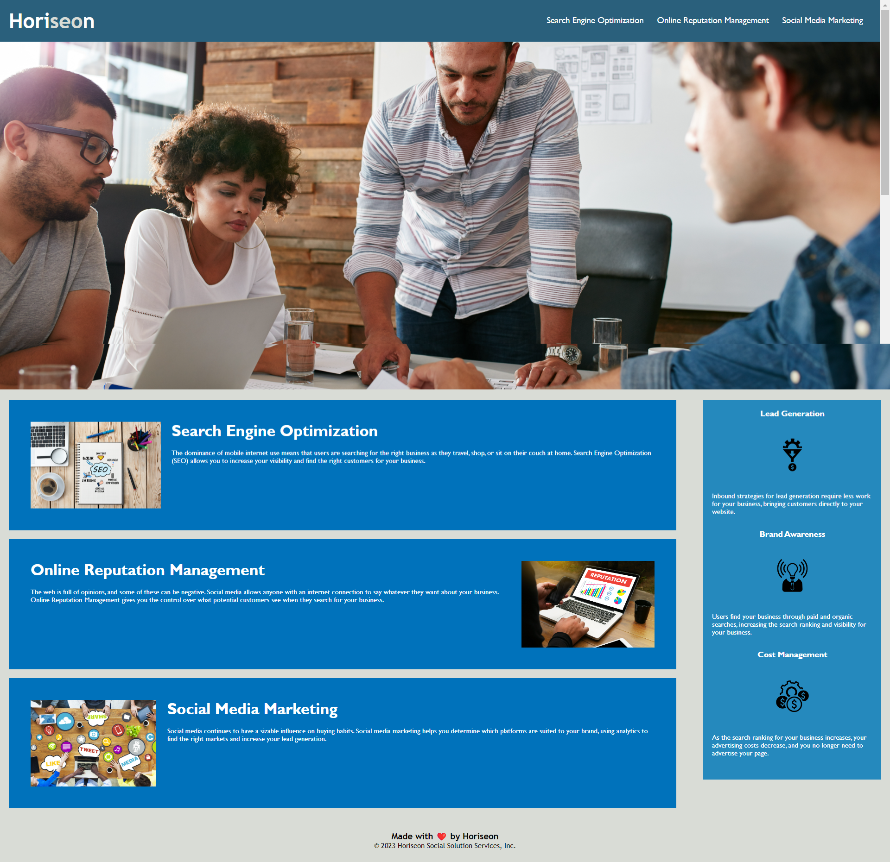
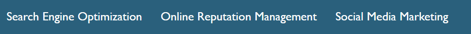
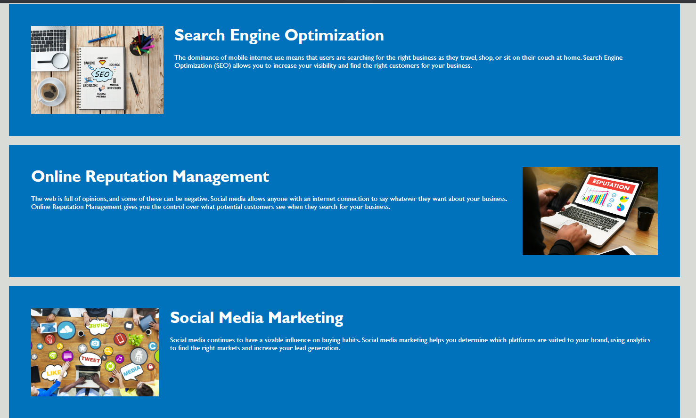
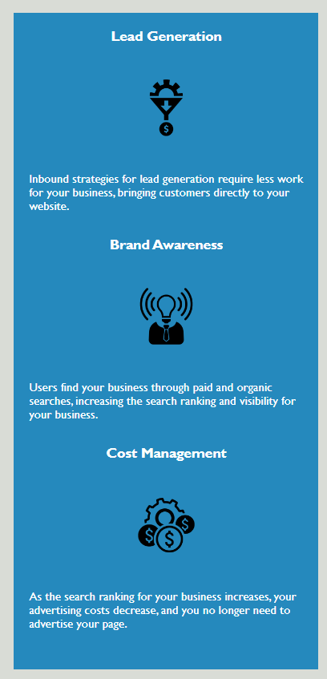
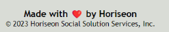

# Horiseon WebSite

* This website its meet accessibility standards.
* The code has semantic HTML elements 
* HTML elements follow a logical structure independent of style and positioning
* All image and icon elements contain accessible "alt" attributes

## The Horiseon webpage includes:  
### Navigation bar
*Bar navigation links direct to the requested page location

### Header image

### Cards with text and images at the bottom of the page

### Aside section

### Footer

* Application's links all function correctly. 

* Application's CSS selectors and properties are consolidated and organized to follow semantic structure.

* Application's CSS file is properly commented.

* Live URL. [Horiseon.com](https:///) 

* Application loads with no errors. 

* GitHub repository that contains application code. [GitHub Repository](https://github.com/luiz-araujjo/horiseon-code-refactor) 
